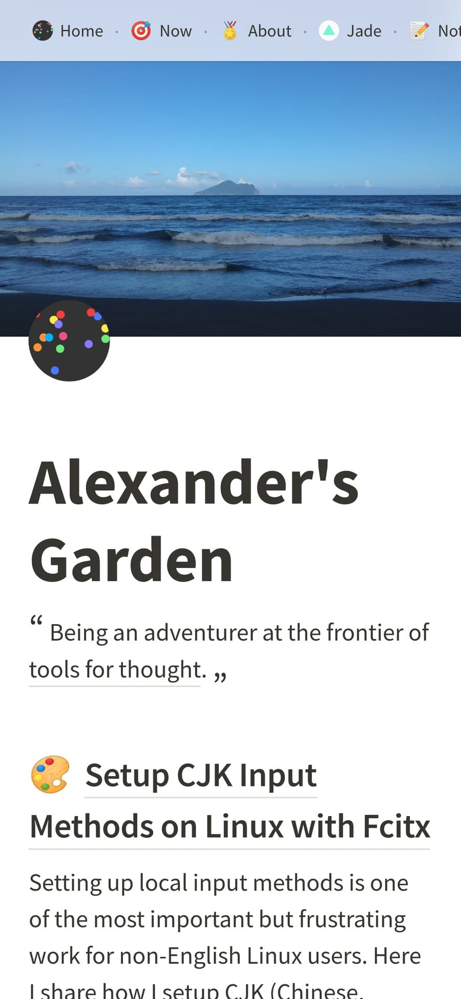
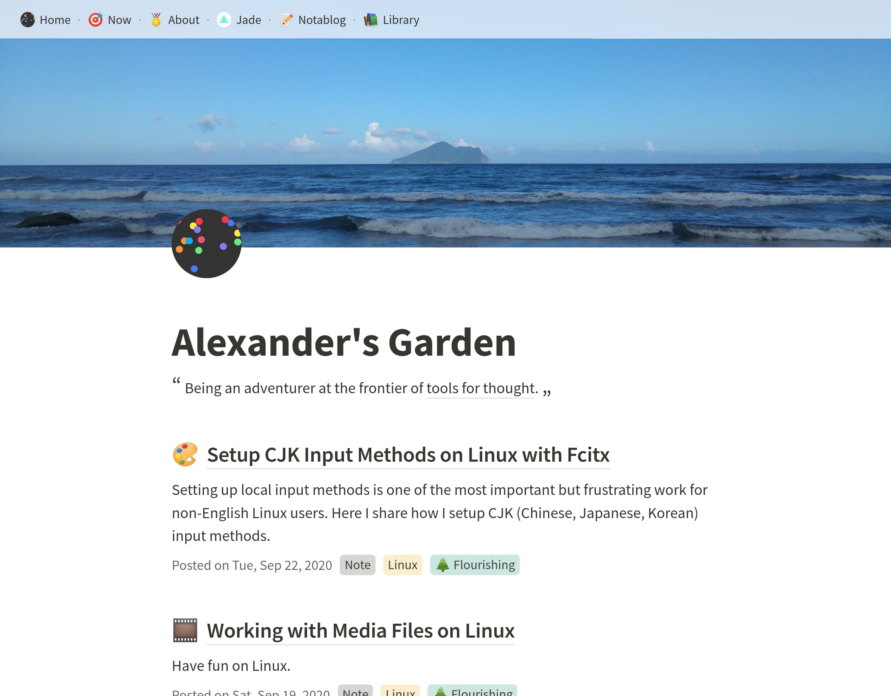
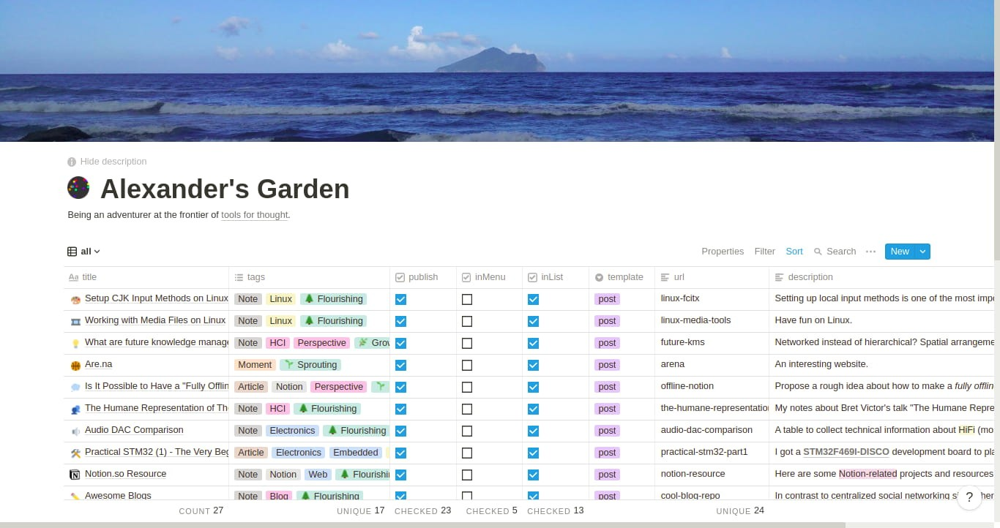

# Notablog

 

Generate a minimalistic blog from a Notion.so table.

Below are some screenshots of [my blog](https://dragonman225.js.org/). 🙂

|            Mobile             |            Desktop             |
| :---------------------------: | :----------------------------: |
|  |  |

| Management Interface on Notion.so |
| :-------------------------------: |
|      |

## Table of Contents

- [Getting Started](#Getting-Started)
- [Blog Management Interface](#Blog-Management-Interface)
- [API Reference](#API-Reference)
- [Notes](#Notes)

## Getting Started

> Make sure you have Node.js v12.0.0 or higher. Check with command `node -v`.

> For existing users who want to upgrade from v0.3.x, please go through all below steps (do a clean install), except that you can continue to use your Notion table.

1. Install Notablog.

   ```bash
   npm i -g notablog
   ```

2. Clone the [`notablog-starter`](https://github.com/dragonman225/notablog-starter) repository.
   ```bash
   git clone https://github.com/dragonman225/notablog-starter.git
   ```
3. Duplicate this [Notion table template](https://www.notion.so/b6fcf809ca5047b89f423948dce013a0?v=03ddc4d6130a47f8b68e74c9d0061de2).

4. Make the table you've duplicated **public** and **copy its URL** for the next step.

5. Go into `notablog-starter/` directory, open `config.json`. Replace the value of `url` with the URL of the table you've duplicated.

6. Inside `notablog-starter/` directory, run command:

   ```bash
   notablog generate .
   ```

7. After it finishes, go to `notablog-starter/public/` directory, open `index.html` with a browser to preview your site.

- Optionally, you could change the `previewBrowser` field in `config.json` to the path of a browser executable you have on your computer and issue the following command anywhere to preview.

  ```bash
  notablog preview <path_to_the_notablog-starter>
  ```

### Congratulations! Your website is ready now!

- You can copy files in `notablog-starter/public/` directory to a server or upload them to any static hosting service to share your content with the world.

- Whenever you want to update your site, go into `notablog-starter/` directory and issue command `notablog generate .`, or issue the command from outside `notablog-starter/` with the pattern `notablog generate <path_to_the_notablog-starter>`.

- Some options for static hosting services:

  - [Github Pages](https://pages.github.com/)
  - [Netlify](https://www.netlify.com/)
  - [surge.sh](https://surge.sh)

- Some options for self-hosting:

  - [nginx](https://www.nginx.com/)
  - [lighttpd](https://www.lighttpd.net/)
  - [Apache httpd](https://httpd.apache.org/)

## Blog Management Interface

This is the documentation of [Notion table template](https://www.notion.so/b6fcf809ca5047b89f423948dce013a0?v=03ddc4d6130a47f8b68e74c9d0061de2)

|  Column Name  | Property Type  |                                                                      Description                                                                       |
| :-----------: | :------------: | :----------------------------------------------------------------------------------------------------------------------------------------------------: |
|    `title`    |    `Title`     |                                                                    The page title.                                                                     |
|    `tags`     | `Multi-Select` |                                                              Topics related to the page.                                                               |
|   `publish`   |   `Checkbox`   |                                                        Determine if a page should be rendered.                                                         |
|   `inMenu`    |   `Checkbox`   |                                                Determine if a page should appear in the navigation bar.                                                |
|   `inList`    |   `Checkbox`   |                                                 Determine if a page should appear in the article list.                                                 |
|  `template`   |    `Select`    |                           Specify which template to use for the page. Available template names depend on the theme you use.                            |
|     `url`     |     `Text`     | A string to be used as the filename and the URL of the generated page. It should not contain `/` and `\`. If it's empty, the `id` of the page is used. |
| `description` |     `Text`     |                                                      Short intro of the page. Styles are working.                                                      |
|    `date`     |     `Date`     |                      User customizable date, convenient for importing posts from other platforms or adjusting the order of posts.                      |

- **Tip**: Check `publish` but leave `inMenu` and `inList` unchecked to make a page seem like _hidden_ because people can only view it when they know its URL.

## API Reference

### Introduction

Notablog is a command-line tool that works on a [`notablog-starter`](https://github.com/dragonman225/notablog-starter) to generate sites. `notablog-starter` contains user config and customizable themes, and is used to store cached data and generated site. The design is inspired by [hexo](https://github.com/hexojs/hexo), a popular static site generator.

### Folder Structure of `notablog-starter`

```
notablog-starter
├── config.json
├── public
├── cache
└── themes
    ├── pure
    └── pure-ejs
```

- `config.json` - User configuration.

  |     Field      |  Type  |                             Description                              |
  | :------------: | :----: | :------------------------------------------------------------------: |
  |      url       | string |         The URL of a Notion table compatible with Notablog.          |
  |     theme      | string | The theme to use. It should be one of the folder names in `themes/`. |
  | previewBrowser | string |          The path to the browser executable for previewing.          |

- `public/` - Contains generated static assets.

- `cache/` - Stores cached NAST representation of Notion pages. When running `notablog generate ...`, if a page is not updated since last run, Notablog use the cached data to render.

- `themes/` - Stores themes.

### Theme

A theme contains layout templates, CSS files, fonts, and other assets that shapes the style and look of a blog.

#### Folder Structure

```
<name>
├── layouts
├── assets
└── manifest.json
```

- `<name>` - Theme folder name, also the name to be used in `notablog-starter/config.json`.
- `layouts/` - Contains page templates. It is required to have one index layout (`index.html`), one post layout (`post.html`), and one tag layout (`tag.html`). You can have more templates, and a user can use them by specifying the template's filename in `template` column on Notion table.
- `assets/` - Other assets. Anything in this folder will be copied to `notablog-starter/public/` when running `notablog generate ...`.
- `manifest.json` - Theme configuration.

  |      Field      |  Type  |                                              Description                                               |
  | :-------------: | :----: | :----------------------------------------------------------------------------------------------------: |
  | notablogVersion | string |                                      Supported Notablog version.                                       |
  | templateEngine  | string | The template engine to use, depending on the template language you use. Currently only "ejs" is valid. |

#### Template Language

- Currently only [EJS](https://ejs.co/), but it's possible to support more since there's an interface designed for extension. Open an issue if you would like to contribute.

- Template `index.html` gets the following object:

  ```typescript
  {
    siteMeta: SiteContext
  }
  ```

- Template `tag.html` gets the following object:

  ```typescript
  {
    siteMeta: SiteContext
    tagName: string
    pages: PageMetadata[]
  }
  ```

- Template `post.html` or others gets the following object:

  ```typescript
  {
    siteMeta: SiteContext
    post: PageMetadata & { contentHTML: string } // All properties of PageMetadata plus contentHTML.
  }
  ```

> It is highly recommended to take a look at [the default theme "pure-ejs"](https://github.com/dragonman225/notablog-starter/tree/master/themes/pure-ejs) if you want to make your own!

## Notes

### Code Structure

Generated by `dependency-cruiser` NPM package.


### Project Status

See https://dragonman225.js.org/notablog-stat.html
